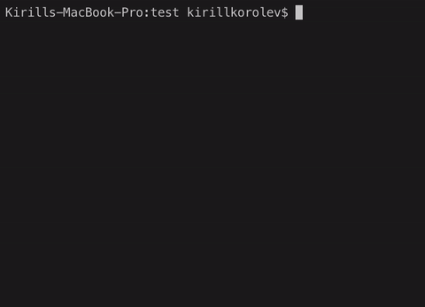

# Competitive Programming Tester
Tool for testing your algorithms



## Getting Started

### Prerequisites

Project is built by **make** which uses **gcc** (or **clang** for Mac) for compiling. Currently **Makefile** uses **POSIX**-compliant commands, so it is not tested on **Windows**.
### Installing

To build the command-line tool
```
make
```
All the binaries and object files are now in the **build** directory. You can install the binary by running
```
sudo make install
```

## Command-line interface

### Usage
```
cptc [OPTIONS] program
```

### Options

| Name        | Description                                                                    |
| ----------- | ------------------------------------------------------------------------------ |
| -h,--help   | Print this help message and exit                                               |
| -i,--input  | Input file (i.txt by default)                                                  |
| -o,--output | Output file (o.txt by default)                                                 |
| -d,--dir    | Directory with tests (current directory by default)                            |
| -n,--num    | Number of tests (i[1..n].txt and o[1..n].txt files will be used)               |
| -s,--silent | Do not print additional test info                                              |
| -t,--tests  | Tests ranges divided by comma (a:b, n, ...)                                    |
| -e,--time   | Test's execution time                                                          |
| -m,--min-per-thread | Minimum number of tests per thread (3 by default)                      |
| --single-thread | All tests are executed on a single thread                                  |
| -b, --bin-dir | Directory with binaries                                                      |
### Language support
- **C++** 
- **Java** 
- **Python** 
- **Go** 

You can setup compilers and their flags for these languages in `cptc.yaml`. By default `cptc` will look for config at the root in `~/cptc.yaml`.
### Dependencies

- Header-only [CLI11](https://github.com/CLIUtils/CLI11) for arguments parsing

## Example
Suppose your project structure is the following
```
- tests
    - i1.txt
    - o1.txt
    - i2.txt
    - o2.txt
- bin
A.cpp
```

Then run your program `A.cpp` with tests located in the `test` directory by running
```
cptc A.cpp -b bin -d tests -n 3
```


​              